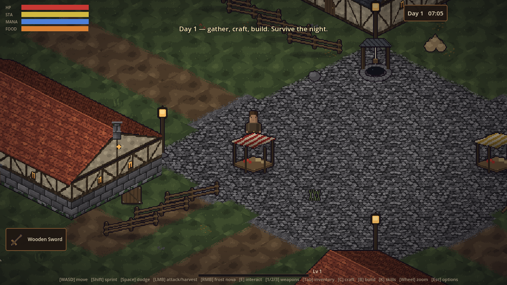
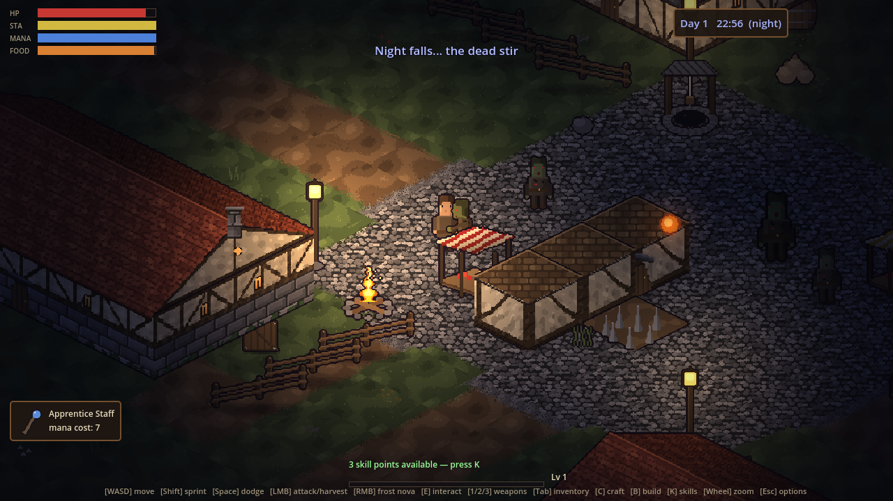
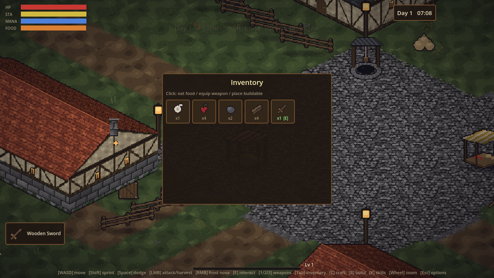
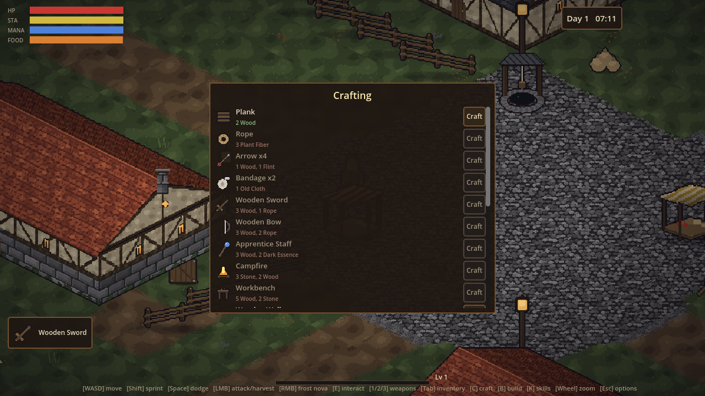
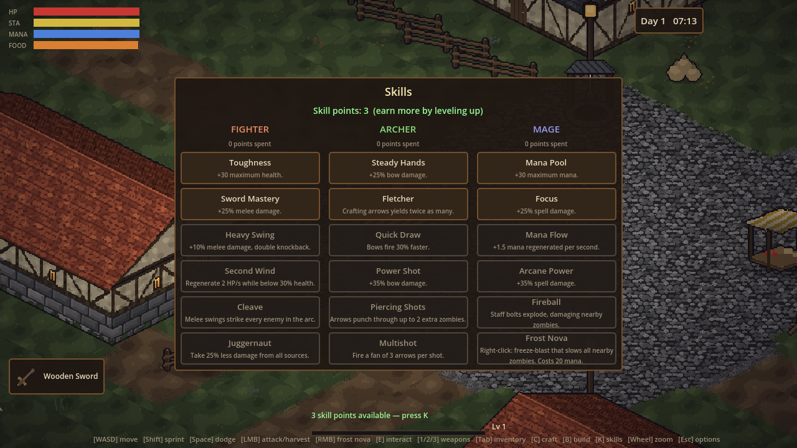
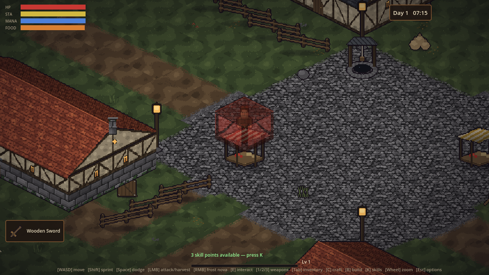

# Medieval Zombie Survival

An isometric medieval zombie survival game for **Godot 4.3+**, inspired by Project Zomboid.
Gather resources, craft gear, fortify a camp, and level three skill trees — **Fighter**,
**Archer**, and **Mage** — while the dead grow stronger every night.

The world is a fixed, hand-authored map with two settlements: a small **starter town**
(cobbled plaza, well, market stalls, blacksmith forge, lamp-lit streets) where you spawn,
and a larger **walled city** to the north — round watchtowers, a crenellated **castle
keep**, manor, tavern and forge — overrun by the dead and full of loot.




## Running the game

1. Install [Godot 4.3 or newer](https://godotengine.org/download) (standard build).
2. Open this folder (`medieval-zombie-survival/`) as a project in the Godot project manager.
3. Press **F5** (Run Project).

All sprites and sound effects are pre-generated and committed, so no extra steps are needed.

## How to play

Survive as many days as you can. Days are ~7 real minutes; night falls at 21:00 and the
horde grows larger and more aggressive every day.

| Input | Action |
|---|---|
| `WASD` / arrows | Move |
| `Shift` | Sprint (drains stamina) |
| `Space` | Dodge roll (i-frames, costs stamina) |
| Left mouse | Attack / harvest (aim with mouse) |
| Right mouse | Frost Nova (once learned) |
| `E` | Interact: open doors and chests, repair structures (1 wood) |
| `1` / `2` / `3` | Swap between owned melee / bow / staff weapons |
| `Tab` or `I` | Inventory (click food to eat, weapons to equip, buildables to place) |
| `C` | Crafting |
| `B` | Build menu |
| `K` | Skill trees |
| Mouse wheel | Zoom in / out |
| `Esc` | Options menu (pauses) / close panels / cancel build mode |

### Survival loop

- **Harvest** trees (wood), rocks (stone, flint, iron), bushes (berries, fiber) and
  mushrooms by hitting them. Ruins can be mined for stone and hide lootable chests.
- **Hunger** drains constantly: eat berries, mushrooms, or cook stew at a campfire.
  Staying well-fed slowly regenerates health.
- **Craft** weapons, ammo, and structures. A **workbench** unlocks advanced recipes
  (iron sword, longbow, arcane staff, stone walls); a **campfire** unlocks cooking and
  gives light at night.
- **Build** walls, doors, barricades, and spike traps to fortify a camp. Zombies bash
  structures that block their path — repair them with wood (`E`).
- **Zombies** drop cloth, iron scraps, and **dark essence** (more at night), the fuel
  for magic staves.
- **Combat**: melee swings chain into a 3-hit combo with a heavy finisher; all attacks
  can crit; dodge roll through hordes with `Space`. Zombies lurch, flank around
  obstacles, and leave corpses and blood where they fall. There are no enemy health
  bars or damage numbers — read a zombie's wounds by how bloodied it looks.
- **Noise is death.** Zombies have short sight but sharp ears: melee swings, sprinting,
  hammering structures, doors, magic, and especially explosions all draw the horde to
  the sound. Bows are quiet. Fighting loud in the open invites a swarm.
- **Wounds**: zombie hits can open a bleeding wound that drains health until you use a
  bandage (craft 2 from 1 cloth) or a salve. Healing from food is slow — survival
  favors not getting hit at all.
- **Exhaustion**: below 20 stamina your swings turn feeble and slow. Manage sprinting
  and attacking, or the horde will catch you winded.

### Enemies

| Type | Behavior |
|---|---|
| Walker | Slow, steady, the bulk of the horde |
| Runner | Fast and twitchy; mostly prowls at night |
| Brute | Slow, huge health pool, demolishes structures |

### Population

The horde follows a Project Zomboid-style population model: the world's zombie
count grows every day until it peaks (around day 9 on Normal), after which the
dead **regenerate slowly** — clearing a district keeps it clear for a while.
Zombies are densest inside the walled city, common around the town, and sparse
in the wilderness. At night the population swells, senses sharpen, and runners
come out.

### Sandbox options (`Esc`)

Every difficulty knob is adjustable in-game and saved between sessions:
zombie population / speed / strength / senses, wound & bleeding chance, loot
abundance, XP rate, and day length.

### Skill trees

Kills, harvesting, and crafting grant XP; each level grants one skill point (`K`).

- **Fighter** — Toughness, Sword Mastery, Heavy Swing, Second Wind, Cleave, Juggernaut.
- **Archer** — Steady Hands, Fletcher, Quick Draw, Power Shot, Piercing Shots, Multishot.
- **Mage** — Mana Pool, Focus, Mana Flow, Arcane Power, Fireball (exploding bolts),
  Frost Nova (right-click AoE slow).

Deeper skills require prerequisite skills and points already spent in that tree, so you
can specialize or hybridize.

## Project structure

```
project.godot            Godot 4.3 project (input map is registered in code)
scenes/Main.tscn         Entry scene (everything is constructed in code)
scripts/
  autoload/              Game state, item/recipe DB, skill trees, FX helpers
  world/                 Procedural world gen, structures, resources, building
  player/                Player controller and inventory
  enemies/               Zombie AI (wander/chase/attack/bash)
  combat/                Projectiles (arrows, firebolts, frost)
  ui/                    HUD, inventory/crafting/build/skill panels
assets/                  Generated pixel art and sound effects
tools/                   Asset generators (Python 3 + Pillow)
```

## Regenerating assets

All pixel art and audio is procedurally generated for a consistent style:

```bash
pip install pillow
python3 tools/generate_assets.py   # sprites, tiles, icons, FX
python3 tools/generate_sfx.py      # retro WAV sound effects
```

## Screenshots

| | |
|---|---|
|  |  |
|  |  |
